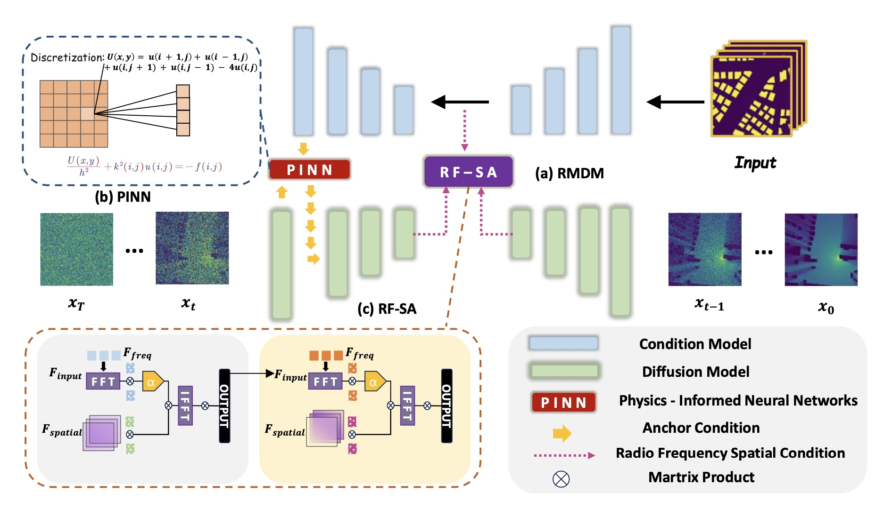

# 📡 RMDM: Radio Map Diffusion Model with Physics-Informed Networks 🚀

> **"When Einstein Meets Deep Learning"** — We make radio signals elegantly dance to the laws of physics in virtual cities. 💃

## 🌟 Project Highlights



- 🧠 **Physics-Informed AI**: Equipping neural networks with electromagnetic wisdom, enabling AI to think using Helmholtz equations.
- 🎭 **Dual U-Net Architecture**: Two neural nets—one handling physical laws, the other refining details—working seamlessly to reconstruct radio maps.
- 📉 **Record-Breaking Accuracy**: Achieved an unprecedented 0.0031 NMSE error in static scenarios, 2× better than state-of-the-art methods!
- 🌪️ **Dynamic Scene Mastery**: Robust reconstruction in dynamic, interference-rich environments (vehicles, moving obstacles) with an impressive 0.0047 NMSE.
- 🕵️ **Sparse Data Champion**: Capable of accurately reconstructing complete radio maps even from a mere 1% sampling—like Sherlock deducing from minimal clues.

## 🎯 Problems Solved

- 🧩 **Signal Reconstruction Puzzle**: Restoring complete electromagnetic fields from fragmented measurements.
- 🌆 **Urban Maze Complexity**: Seamlessly handling complex obstructions from buildings, moving vehicles, and urban environments.
- ⚡ **Real-Time Performance**: Achieving inference speeds up to 10× faster than traditional methods—ideal for real-time 5G/6G applications.

## 🧠 Core Technical Innovations

### 🎵 **Dual U-Net Symphony**

1. **Physics-Conductor U-Net**: Embeds physical laws (Helmholtz equations) through Physics-Informed Neural Networks (PINNs).
2. **Detail-Sculptor U-Net**: Uses advanced diffusion models for ultra-fine precision in radio map reconstruction.

### 🔥 **Three Innovative Modules**

- 🎯 **Anchor Conditional Mechanism**: Precisely locking onto critical physical landmarks (like GPS for radio signals).
- 🌐 **RF-Space Attention**: Models "frequency symphonies" enabling focused learning of electromagnetic signal characteristics.
- ⚖️ **Multi-Objective Loss**: Harmonizing physics-based constraints and data-driven fitting to achieve optimal results.

## 📂 Benchmark Dataset

Leveraged the authoritative **RadioMapSeer dataset**:

- 700+ real-world urban scenarios (London, Berlin, Tel Aviv, etc.)
- 80 base stations per map with high-resolution 256×256 grids
- Incorporates static and dynamic challenges (buildings, vehicles)

## 📜 Academic Citation

```bibtex
@misc{jia2025rmdmradiomapdiffusion,
      title={RMDM: Radio Map Diffusion Model with Physics Informed}, 
      author={Haozhe Jia and Wenshuo Chen and Zhihui Huang and Hongru Xiao and Nanqian Jia and Keming Wu and Songning Lai and Yutao Yue},
      year={2025},
      eprint={2501.19160},
      archivePrefix={arXiv},
      primaryClass={cs.CV},
      url={https://arxiv.org/abs/2501.19160}, 
}
```

## 🙌 Acknowledgments

Special thanks to:
- 🏫 Joint Laboratory of Hong Kong University of Science and Technology (Guangzhou) & Shandong University
- 🌉 Guangzhou Education Bureau's Key Research Project
- 🤖 DIILab for generous computational support


---

**License**: This project is distributed under the **Academic Free License v3.0**. Please cite accordingly for academic use. For commercial applications, contact the authors directly.

